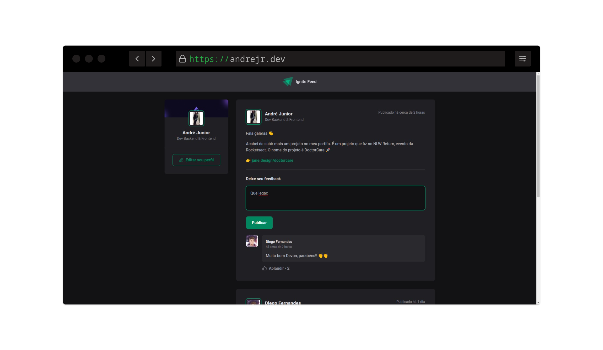

<h1 align="center">
    
    <br>
</h1>

<h4 align="center">
  <p>Ignite Feed</p>

  <p>O Ignite Feed é um projeto desenvolvido em ReactJS,
    para aprofundar nos fundamentode React.</p>
</h4>

<p align="center">
  <a href="https://andrejr.dev">
    
  </a>
</p>


<p align="center">
  <a href="#rocket-tecnologias">Tecnologias</a>&nbsp;&nbsp;&nbsp;|&nbsp;&nbsp;&nbsp;
  <a href="#information_source-como-instalar">Como instalar</a>&nbsp;&nbsp;&nbsp;
</p>

<p align="center">
  
</p>

## :rocket: Tecnologias

Este projeto foi desenvolvido com as seguintes tecnologias:

- [Vite](https://vitejs.dev/)
- [HTML](https://developer.mozilla.org/pt-BR/docs/Web/HTML)
- [CSS](https://www.w3.org/Style/CSS/Overview.en.html)
- [ReactJS](https://pt-br.reactjs.org/)
- [Typescript](https://www.typescriptlang.org/)

## :information_source: Como instalar

Para clonar e executar este aplicativo, você precisará do [Git](https://git-scm.com) instalado em seu computador. Da sua linha de comando:

```bash
# Clonar este repositório
$ git clone https://github.com/andrejr971/ignite-feed.git

# Navegue até o repositório
$ cd ignite-feed

#instale os pacotes
$ npm install

# Execute a aplicação em modo de desenvolvimento
$ npm run dev

# A aplicação será aberta na porta:3000 - acesse http://localhost:300
```


---

Feito by André Junior :wave: [portifólio](https://andrejr.dev)
